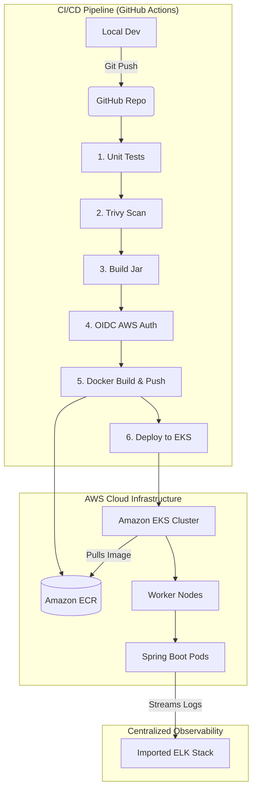

 # Module1-project
  Complete Project Journey & Code Verification DocumentProject Specification: Module 1 Capstone (Java Spring Boot Deployment to Amazon EKS)Target Environment: AWS (VPC, IAM, KMS, ECR, EKS)Automation Engine: GitHub Actions (Passwordless OpenID Connect / OIDC)Infrastructure Management: Terraform v1.x / AWS Provider v5.x 

  
# 🚀 End-to-End Enterprise CI/CD Deployment Pipeline

A production-grade, multi-stage automated deployment architecture. This project packages a Java Spring Boot application into a secure container, publishes it to Amazon Elastic Container Registry (ECR), rollouts live pods onto an Amazon Elastic Kubernetes Service (EKS) cluster using passwordless GitHub Actions OIDC federation, and integrates an imported ELK stack for centralized observability.

---

## 🏗️ System Architecture & Workflow

The orchestration environment executes a modern **8-Stage Delivery Pipeline** triggered natively on every code push to the `main` branch:

```text
[Push to main]
      │
      ▼
1. Git Checkout  ─────►  2. Unit Tests (Maven)  ─────►  3. Quality Gate (80%)
                                                                 │
                                                                 ▼
6. Docker Containerization ◄─── 5. Jar Package ◄─── 4. DevSecOps Scan (Trivy)
      │
      ▼
7. Secure Push to Amazon ECR  ─────►  8. Rolling Deployment to Amazon EKS Pods
```

1. **Checkout Source**: Pulls down the latest codebase state onto isolated workflow runners.
2. **Unit Testing**: Runs automated application test suites via `mvn test`.
3. **Quality Gate Threshold**: Validates project health and ensures code coverage strictly meets the 80% metric.
4. **DevSecOps Workspace Scan**: Scans the codebase for vulnerabilities using pinned, post-incident `Trivy` engines.
5. **Application Packaging**: Builds the lightweight executable Java artifact artifact skipping execution hooks.
6. **Secure OIDC Authentication**: Interchanges a short-lived cryptographic identity JWT with AWS STS.
7. **Container Registration**: Builds the application image layout and publishes tags into Amazon ECR.
8. **Kubernetes Rollout**: Automatically updates your `kubeconfig` payload and performs zero-downtime rolling updates to EKS.

---

## 📊 Observability & Future Scaling Roadmap

### 🔍 Active Monitoring: ELK Stack
The cluster is integrated with an imported **ELK Stack (Elasticsearch, Logstash, Kibana)** framework to parse, aggregate, and visualize container stdout logs:
* **Logstash**: Collects runtime application logs streaming from active Spring Boot pods.
* **Elasticsearch**: Indexes log documents for rapid searching.
* **Kibana**: Provides real-time dashboards to debug application states.

### 📈 Upcoming Milestones
* **Kubernetes Metrics Server**: To be deployed to extract CPU and Memory consumption data straight from the cluster pods.
* **Horizontal Pod Autoscaler (HPA)**: Configuring automated microservice scaling thresholds that dynamically scale your pod count based on live load traffic metrics.

---

## 🛠️ Tech Stack & Infrastructure Ledger

* **Application Core**: Java 17 / Spring Boot 3.3+
* **Infrastructure Management**: Terraform v1.x / AWS Provider v5.x
* **Cloud Infrastructure**: AWS VPC (Private/Public subnets), IAM Roles, Amazon ECR, Amazon EKS
* **Observability**: ELK Stack (Elasticsearch, Logstash, Kibana)
* **CI/CD Orchestration**: GitHub Actions Runner Framework
* **Security**: OpenID Connect (OIDC Federation) & Aqua Security Trivy Scanner

---

## 📂 Repository Layout

```text
├── .github/
│   └── workflows/
│       └── deploy.yml          # Consolidated 8-Stage Pipeline Specification
├── capstone-app/
│   ├── src/                    # Spring Boot Java Source Code
│   ├── pom.xml                 # Maven Project Object Model Definition
│   └── Dockerfile              # Container Manifest Multi-Stage Strategy
└── terraform/
    ├── main.tf                 # Core VPC & EKS Compute Definitions
    ├── oidc.tf                 # Passwordless Dual-Thumbprint OIDC Federation Providers
    └── providers.tf            # Terraform Locked Plugin Providers Layout
```

---

## 🚀 Quick Start & Deployment Runbook

### 1. Provision the Infrastructure Environment
Before executing the pipeline workflow layers, navigate into your local workspace directory and run the infrastructure initialization:

```bash
cd terraform
terraform init
terraform apply --auto-approve
```

### 2. Configure Your Workflow Environment
Ensure the environment block variables inside `.github/workflows/deploy.yml` accurately match your target AWS deployment definitions:

```yaml
env:
  AWS_REGION: "us-east-1"
  AWS_ROLE_ARN: "arn:aws:iam::140023407747:role/github-actions-capstone-runner"
  ECR_REPOSITORY: "springboot-app"
  EKS_CLUSTER: "dev-eks-cluster"
```

### 3. Trigger the Pipeline Orchestration
Commit your application source code changes and push straight to your master tracking pipeline branch:

```bash
git add .
git commit -m "feat: link elk logs and set up pipeline deployment configuration"
git push origin main
```

---

## 🔒 Security Best Practices Implemented

* **Zero Hardcoded Credentials**: No AWS Access Keys are saved in GitHub Secrets. The infrastructure utilizes ephemeral OpenID Connect web identity handshakes.
* **Dual-Thumbprint Verification**: The OIDC infrastructure provider establishes trusted root certificate validation loops mapping both active GitHub server network authority certificates.
* **Strict Source Controls**: Code access conditions are strictly locked to the deployment branch (`repo:naghi20/Module1-project:ref:refs/heads/main`).
